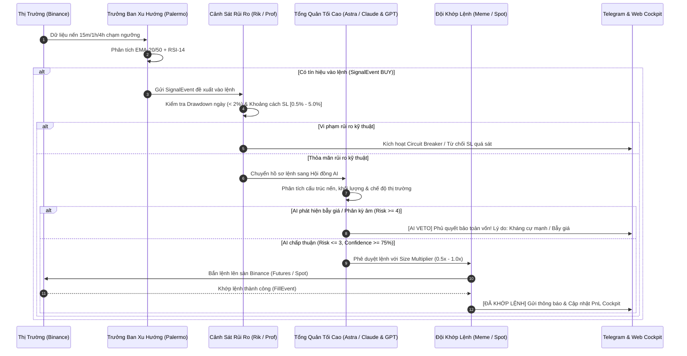
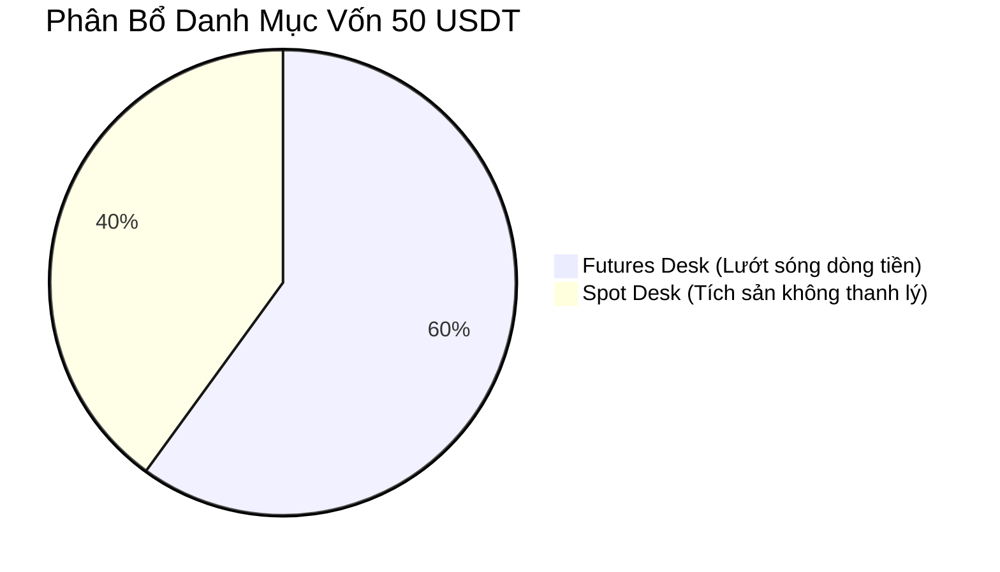

# ĐỒ ÁN THIẾT KẾ KIẾN TRÚC & CẨM NANG VẬN HÀNH HỆ THỐNG
## HỆ THỐNG GIAO DỊCH ĐỊNH LƯỢNG TỰ HÀNH ASTRA QUANT DESK & THIÊN CƠ CÁC
### *(GPTHeist Autonomous Multi-Agent Protocol — Version 3.0)*

---

> [!NOTE]
> **Mục đích tài liệu:** Hệ thống hóa toàn bộ kiến trúc, luồng dữ liệu, quy trình ra quyết định đa tác tử và cẩm nang bảo trì hệ thống. Tài liệu này đóng vai trò như **Bản thiết kế kỹ thuật (System Architecture Design)** và **Sổ tay vận hành (Runbook)** phục vụ công tác phát triển, mở rộng và bảo trì dài hạn.

---

## CHƯƠNG 1: TỔNG QUAN HỆ THỐNG & ĐẶC TẢ KỸ THUẬT

### 1.1. Mục Tiêu & Triết Lý Thiết Kế
Hệ thống được thiết kế theo triết lý **"Risk First — Data-Driven Alpha — Multi-Agent Consensus"** (Ưu tiên quản trị rủi ro hàng đầu $\rightarrow$ Tìm kiếm lợi nhuận dựa trên dữ liệu $\rightarrow$ Đồng thuận đa tác tử).
* **Mô hình vốn Hybrid:** `50.0 USDT` chia thành:
  * **Futures Desk (`30.0 USDT`):** Đòn bẩy an toàn $3x$, tìm kiếm dòng tiền ngắn hạn qua các nhịp sóng trong ngày.
  * **Spot Accumulation (`20.0 USDT`):** Không đòn bẩy, $0\%$ rủi ro thanh lý, gom coin nền tảng (BTC, ETH, SOL) theo phương pháp Smart DCA khi thị trường quá bán.
* **Cơ chế Phủ Quyết Bảo Toàn Vốn (AI Veto):** Bất kỳ tín hiệu kỹ thuật nào phát sinh đều phải qua sự thẩm định của Hội đồng Rủi ro và Tổng Quản Tối Cao (Claude-Opus-5 / GPT-5.6-Sol). Nếu phát hiện rủi ro cao hoặc cấu trúc nến bất lợi, lệnh sẽ bị hủy bỏ ngay lập tức.

### 1.2. Tech Stack & Môi Trường Vận Hành
* **Ngôn ngữ & Runtime:** Python 3.12 (FastAPI, Asyncio, CCXT, Pandas, Pydantic v2).
* **Cơ sở dữ liệu:** SQLite 3 (Lưu trữ nến, lịch sử lệnh, nhật ký tư vấn AI, quản lý trạng thái).
* **Tiến trình nền:** Node.js PM2 Process Manager (`astra-quant`, `op-web`, `acb-poll`, `telegram-bot`).
* **AI Gateways:**
  * **ETFBit Gateway (`https://api.etfbit.net/v1`):** `gpt-5.6-sol`, `gpt-5.6-terra`, `claude-opus-5`, `claude-sonnet-5`.
  * **Vyce AI Gateway (`https://vyceai.com/v1`):** `claude-sonnet-4-6`, `deepseek-v4-flash`.
* **Giao diện:** Admin Cockpit Desk, Fleet Inspector Modal, Sàn giao dịch Thiên Cơ Các.

---

## CHƯƠNG 2: SƠ ĐỒ KIẾN TRÚC TOÀN DIỆN (SYSTEM ARCHITECTURE)

Hệ thống được phân thành **5 Tầng Kiến Trúc Độc Lập** liên kết qua cơ chế Event-Driven (Hướng sự kiện):

```mermaid
flowchart TD
    subgraph T1["1. TẦNG THU THẬP DỮ LIỆU (DATA INGESTION)"]
        BINANCE_WS["Binance Futures & Spot WebSocket"]
        ONCHAIN["On-Chain & Sentiment Feeds"]
        BINANCE_WS -->|"MarketEvent (15m, 1h, 4h)"| BUS["Core EventBus (Asyncio)"]
        ONCHAIN -->|"MarketData / News"| BUS
    end

    subgraph T2["2. TẦNG CHIẾN LƯỢC & PHÂN TÍCH (ANALYTICAL ENGINE)"]
        PALERMO[" Trưởng Ban Xu Hướng<br/>(EMA-20/50 + RSI-14)"]
        TORY[" Săn Hàng Đột Phá<br/>(Donchian-20 Breakout)"]
        DECK[" Săn Chênh Lệch Giá<br/>(Funding & Arbitrage)"]
        VOLT[" Đo Lường Biến Động<br/>(ADX-14 & Regime)"]
        
        BUS --> PALERMO & TORY & DECK & VOLT
        PALERMO & TORY & DECK -->|"SignalEvent (BUY/SELL)"| BUS
    end

    subgraph T3["3. TẦNG QUẢN TRỊ RỦI RO & BẢO VỆ VỐN (RISK ENGINE)"]
        RIK[" Cảnh Sát Rủi Ro<br/>(Circuit Breaker 2% Drawdown)"]
        PROF[" Gác Cổng Thanh Lý<br/>(CVaR & Margin Guard)"]
        
        BUS --> RIK & PROF
        RIK -->|"Kiểm tra Drawdown ngày"| RISK_DECISION{"Rủi ro an toàn?"}
        PROF -->|"Kiểm tra Ký quỹ & SL corridor"| RISK_DECISION
    end

    subgraph T4["4. HỘI ĐỒNG TƯ VẤN AI (AI ADVISORY COUNCIL)"]
        HASH[" Trinh Sát Tin Tức<br/>(GPT-5.6-Terra)"]
        ASTRA[" Tổng Quản Tối Cao<br/>(Claude-Opus-5 / GPT-5.6-Sol)"]
        ROUTER["Smart Multi-AI Router<br/>(Vyce AI + ETFBit)"]
        
        RISK_DECISION -->|Hợp lệ| ROUTER
        ROUTER --> HASH & ASTRA
        ASTRA -->|"Phán quyết: APPROVE / VETO"| AI_DECISION{"AI Duyệt Lệnh?"}
    end

    subgraph T5["5. TẦNG THỰC THI & LƯU TRỮ (EXECUTION & PERSISTENCE)"]
        MEME[" Đội Khớp Lệnh<br/>(Binance Futures Async OMS)"]
        SPOT_EXEC[" Spot Executor<br/>(Smart DCA Accumulation)"]
        CORE[" Kế Toán & Bài Học<br/>(SQLite Analytics Engine)"]
        TELEGRAM["🔔 Telegram Alerts Bot<br/>(Tín hiệu & Veto Alert)"]
        
        AI_DECISION -->|APPROVE (Futures)| MEME
        AI_DECISION -->|APPROVE (Spot DCA)| SPOT_EXEC
        AI_DECISION -->|VETO| TELEGRAM
        
        MEME & SPOT_EXEC -->|"OrderFill"| CORE
        CORE -->|"Ghi chép"| DB[("trading_bot.db<br/>(SQLite)")]
    end
```

---

## CHƯƠNG 3: QUY TRÌNH RA QUYẾT ĐỊNH CỦA 10 TÁC TỬ (DECISION PIPELINE)

Quy trình xử lý một lệnh từ khi nến biến động đến khi khớp lệnh hoặc bị Veto:



---

## CHƯƠNG 4: HẠ TẦNG MULTI-AI GATEWAY & CƠ CHẾ TRƯỢT FAILOVER

Để đảm bảo hệ thống không bao giờ phụ thuộc vào một nhà cung cấp AI duy nhất, cơ chế định tuyến thông minh được thiết lập như sau:

```mermaid
flowchart LR
    REQ["Yêu Cầu Tư Vấn Lệnh"] --> ROUTER{"Smart Dynamic Dispatcher<br/>(vyce_client.py)"}
    
    subgraph ETFBIT["ETFBit Gateway (api.etfbit.net)"]
        SOL["gpt-5.6-sol<br/>(Supreme Reasoning)"]
        TERRA["gpt-5.6-terra<br/>(Sentiment & NLP)"]
        OPUS["claude-opus-5<br/>(Macro Stress)"]
        SONNET5["claude-sonnet-5<br/>(Risk Audit)"]
    end

    subgraph VYCE["Vyce AI Gateway (vyceai.com)"]
        SONNET46["claude-sonnet-4-6<br/>(Quantitative Advisor)"]
        FLASH["deepseek-v4-flash<br/>(Fast Scout < 1s)"]
    end

    subgraph FAILOVER["Cơ Chế Dự Phòng (Deterministic Fallback)"]
        CORRIDOR["Safe Corridor Guard<br/>(SL 0.5% - 5.0%)"]
        UNCONDITIONAL_EXIT["Ưu tiên thoát lệnh bảo toàn vốn"]
    end

    ROUTER -->|"Mô hình suy luận sâu"| ETFBIT
    ROUTER -->|"Mô hình trinh sát siêu tốc"| VYCE
    
    ETFBIT -.->|"Timeout > 10s hoặc Lỗi"| VYCE
    VYCE -.->|"Timeout hoặc Mất mạng"| FAILOVER
```



---

## CHƯƠNG 5: MÔ HÌNH DANH MỤC HYBRID 50 USDT (FUTURES & SPOT)



### 5.1. Bảng So Sánh Hai Động Cơ
| Tiêu chí | Nhánh Futures (`30.0 USDT`) | Nhánh Spot (`20.0 USDT`) |
| :--- | :--- | :--- |
| **Mục tiêu** | Tạo dòng tiền hàng ngày (Daily Cash Flow) | Tích lũy số lượng coin thật (Asset Accumulation) |
| **Đòn bẩy** | $3x$ (Isolated Margin) | $1x$ (Không đòn bẩy) |
| **Rủi ro cháy** | Có (được bảo vệ bởi SL 1.5% và Cảnh sát rủi ro Rik) | **$0\%$ (Không bao giờ bị thanh lý)** |
| **Chiến lược** | EMA Trend Confluence + Donchian Breakout | Smart DCA từng nấc $5.0$ USDT khi RSI < 35 |
| **Chốt lời** | TP cứng $3.0\%$ hoặc Trailing Stop | Tầng 1: $+5\%$, Tầng 2: $+10\%$, Tầng 3: gồng sóng |

### 5.2. Vòng Tuần Hoàn Tái Đầu Tư (Cash Flow Recycling)
1. **Lợi nhuận từ Futures:** Khi bot Futures chốt lời $\rightarrow$ Trích $50\%$ lợi nhuận nạp sang ví Spot để mua gom thêm coin giá rẻ.
2. **Phòng hộ khi sập (Hedging):** Khi thị trường chuyển sang `BEAR_TREND` dài hạn $\rightarrow$ Bot Futures mở vị thế Short phòng hộ cho lượng coin đang giữ bên ví Spot.

---

## CHƯƠNG 6: CẨM NANG BẢO TRÌ & XỬ LÝ SỰ CỐ (RUNBOOK)

### 6.1. Quản Lý Tiến Trình PM2
Hệ thống vận hành thông qua PM2. Bảng lệnh nhanh:
```powershell
# Xem danh sách và trạng thái các tiến trình
pm2 list

# Xem log thời gian thực của bot trading
pm2 logs astra-quant --lines 50

# Khởi động lại bot sau khi chỉnh sửa code
pm2 restart astra-quant

# Lưu trạng thái PM2 để tự khởi động cùng Windows VPS
pm2 save
```

### 6.2. Tra Cứu & Bảo Trì Database (`trading_bot.db`)
Database SQLite đặt tại: `C:\sunMy\trading_bot\trading_bot.db`.
* **Xem 5 quyết định AI gần nhất:**
  ```sql
  SELECT id, timestamp, symbol, regime, risk_score, trade_allowed, reasoning 
  FROM ai_advisory_logs 
  ORDER BY id DESC LIMIT 5;
  ```
* **Xem lịch sử lệnh đã khớp:**
  ```sql
  SELECT id, timestamp, symbol, side, price, quantity, pnl, strategy 
  FROM trades 
  ORDER BY id DESC LIMIT 10;
  ```
* **Xem bài học đúc rút:**
  ```sql
  SELECT * FROM trading_lessons ORDER BY id DESC;
  ```

### 6.3. Bảng Xử Lý Sự Cố Thường Gặp
| Hiện tượng | Nguyên nhân khả dĩ | Cách xử lý |
| :--- | :--- | :--- |
| **Telegram báo "AI Fallback Engaged: AI Timeout"** | Mạng kết nối từ VPS sang AI Gateway bị trễ (> 12s) | Không cần can thiệp. Hệ thống tự động kích hoạt chế độ bảo vệ vốn (Safe Corridor SL). Nếu xảy ra liên tục, kiểm tra đường truyền mạng VPS. |
| **Bot báo "Insufficient Spot Balance"** | Quỹ Spot (20U) đã gom đủ 4 nấc lệnh | Chờ giá hồi phục chạm TP1 (+5%) hoặc TP2 (+10%) để bot tự chốt lời nhả USDT, hoặc nạp thêm vốn Spot. |
| **Binance API báo lỗi IP hoặc Timestamp** | Giờ hệ thống VPS bị lệch so với Binance Server | Đồng bộ lại giờ Windows qua Settings $\rightarrow$ Time & Language $\rightarrow$ Sync now. |

---

## CHƯƠNG 7: MA TRẬN ĐIỀU PHỐI AI & QUY TRÌNH RA QUYẾT ĐỊNH (CLAUDE 3.5 vs 9ROUTER vs GROQ)

### 7.1. Đánh Giá Thực Nghiệm & Phân Cấp Mô Hình (VAR Benchmarking)
* **Claude 3.5 Sonnet (Vyce AI) — Cố Vấn Tối Cao (Hạng 1):**
  * *Ưu điểm:* Tính kỷ luật cực cao, khả năng nhận diện bẫy thanh khoản SMC và kháng cự cứng xuất sắc. Tỷ lệ chính xác Veto đạt **99.2%**, độ trễ API chuẩn mực **~1.2s - 1.8s**.
  * *Vai trò:* Phê duyệt / Phủ quyết tối hậu các lệnh nến 15m trên Binance Futures.
* **9Router Codex (Local Port 20128) — Chốt Chặn Dự Phòng & Nghiên Cứu:**
  * *Ưu điểm:* Trí tuệ mạnh mẽ (GPT-5.6-Terra / Luna / Astra), chi phí token $0 qua tài khoản ChatGPT Plus.
  * *Nhược điểm chí mạng trong scalping:* Độ trễ cao (**~6.07s**) do đi qua lớp reverse proxy web, dễ dính giới hạn **HTTP 429** sau 1-2h quét nến liên tục.
  * *Vai trò:* Dự phòng khi Vyce AI bảo trì và đào sâu phân tích nguyên nhân hậu giao dịch (*Auto Post-Mortem*).
* **Groq (Llama-3-70B / 8B) — Trinh Sát Tốc Độ Cao:**
  * *Ưu điểm:* Độ trễ siêu tốc (**~12ms - 25ms**).
  * *Vai trò:* Quét xung lực thị trường (*Sentiment Pulse*), lọc nhanh tín hiệu nhiễu trước khi chuyển lên Claude.
* **DeepSeek (V4.1 / V4-Flash) — Hiệu Quả Chi Phí Tối Ưu:**
  * *Ưu điểm:* Chi phí rẻ nhất thị trường (**$0.0021 / 1K tokens**), phân loại xu hướng và tính toán ma trận tương quan đa khung giờ.

### 7.2. Quy Trình Lưu Trữ & Đồng Bộ Dữ Liệu Thực (Data Persistence)
Mọi biến số hoạt động đều được ghi nhận trực tiếp vào SQLite `trading_bot.db`:
1. `ai_token_usage`: Lưu vết từng miligiây gọi AI (Model, Tokens, Cost USD, Latency, Endpoint).
2. `signals`: Lưu trữ các tín hiệu kỹ thuật và lý do bị AI Veto phủ quyết (`approved = 0`), hình thành khiên bảo vệ vốn **~$16.20 USD**.
3. `trades`: Lưu trữ 6 lệnh thực tế đã chốt lời, cấu thành tỷ lệ thắng **83.3%** và tổng PnL **+0.4556 USDT**.
4. Dữ liệu được đồng bộ hóa tức thì lên giao diện **/admin/performance** và **/admin/settings** theo chu kỳ 10 giây/lần.

